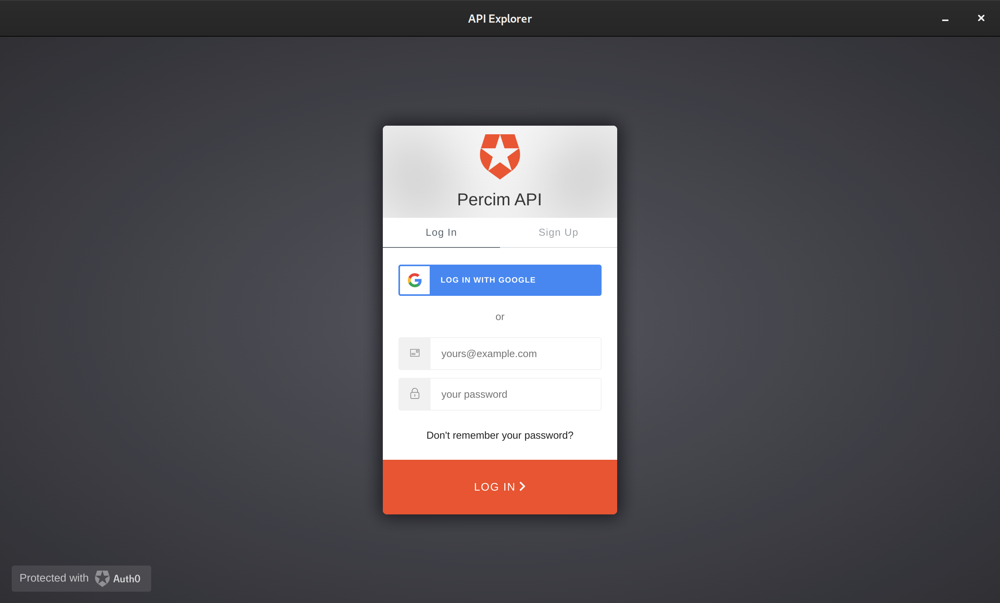
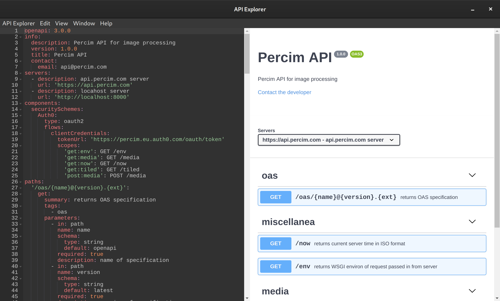

# API Explorer

A user interface to explore [OpenApi specifications][0] (OAS) with support for OAUTH2 via [Auth0.com][1]. For example:




## Installation

```sh
npm install
```

## Configuration

Copy `settings/000-default.json` to `settings/001-custom.json` and replace all configuration values starting with `${APX_..}` — to fully understand each field consult [#authorize-application][2]. Please note, that multiple configuration files will be merged in lexicographical order.

### Auth0: authentication & authorization

```javascript
"auth0": {
```

> your unique ID of the target API you want to access:

```javascript
    "api_identifier": "${APX_AUTH0_AUDIENCE}", // e.g. "https://api.custom.tld/"
```

> your application's ID:

```javascript
    "client_id": "${APX_AUTH0_CLIENT_ID}", // e.g. "00000000...00000000"
```

> your Auth0 domain:

```javascript
    "domain": "${APX_AUTH0_DOMAIN}", // e.g. "custom.auth0.com"
```

> silent (`none`) or explicit (`login`) authentication:

```javascript
    "prompt": "login",
```

> scopes which you want to request authorization for:

```javascript
    "scopes": [
        // e.g. "a:scope", "another:scope", "yet-another:scope"
        "openid", "profile", "offline_access", "${APX_API_SCOPES}"
    ],
```

> URL to which Auth0 will redirect to:

```javascript
    "redirect_uri": "file:///callback"
```

```javascript
}
```

### OAS: OpenApi specification

```javascript
"oas": {
```

> list of allowed API servers (with regex support):

```javascript
    "servers": [
        // e.g. "^https://(.+)\\.custom\\.tld"
        "${APX_OAS_SERVERS}"
    ],
```

> URL to fetch the default OpenApi specification from:

```javascript
    // e.g. "https://api.custom.tld/oas/openapi@latest.yaml"
    "url": "${APX_OAS_URL}"
```

```javascript
}
```

## Packaging

```sh
npm run make
```

## Execution

#### debugging:

```sh
npm start
```

#### production:

```sh
./api-explorer
```

## CLI Arguments

It's also possible to provide a configuration file and/or arguments via the command line interface. Further, environment variables are also recognized (where the values need to be JSON encoded). The precedence order is given as:

* CLI arguments, then
* environment variables, and finally
* configuration files,

where the CLI arguments have the highest precedence, while the configuration files have the least.

#### debugging:

```sh
APX_AUTH0_PROMPT='"login"' npm run -- start -- --json ./settings/01-custom.json
```

#### production:

```sh
APX_AUTH0_PROMPT='"login"' ./api-explorer --json ./resources/app/settings/01-custom.json
```

where the location of the `*.json` configuration can be anywhere, and is not just restricted to the path shown above, and further where each (even nested) configuration entry can be separately defined as well, for example:

#### debugging:

```sh
npm run -- start -- --json ./settings/01-custom.json \
    --auth0.scopes=openid profile offline_access \
    --auth0.scopes=get:my-scope post:my-scope \
    --oas.servers="^https://(.+).custom.tld" \
    --oas.servers="^http://localhost:8000"
```

#### production:

```sh
./api-explorer --json ./resources/app/settings/01-custom.json \
    --auth0.scopes=openid profile offline_access \
    --auth0.scopes=get:my-scope post:my-scope \
    --oas.servers="^https://(.+).custom.tld" \
    --oas.servers="^http://localhost:8000"
```

## FAQ

### Why do I get an `invalid token error`?

This might be due to a left-over (access) token, which has not been removed correctly. Simply delete the corresponding `AUTH0_DOMAIN` folder in your temporary directory, e.g. on Linux for `AUTH0_DOMAIN` `=` `custom.auth0.com` run:

```sh
rm /tmp/custom.auth0.com/ -r
```

[0]: https://www.openapis.org
[1]: https://auth0.com
[2]: https://auth0.com/docs/api/authentication#authorize-application
